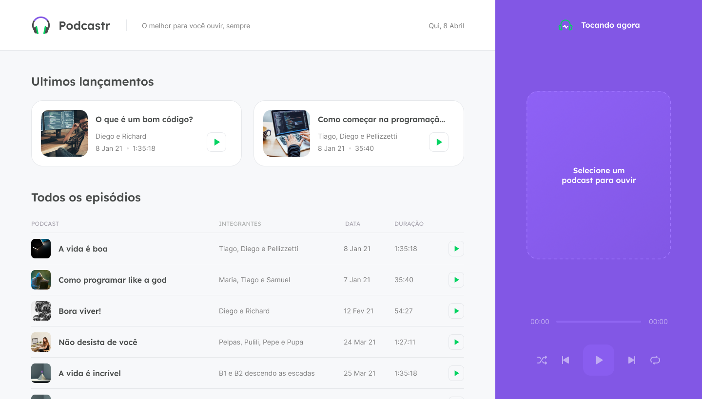
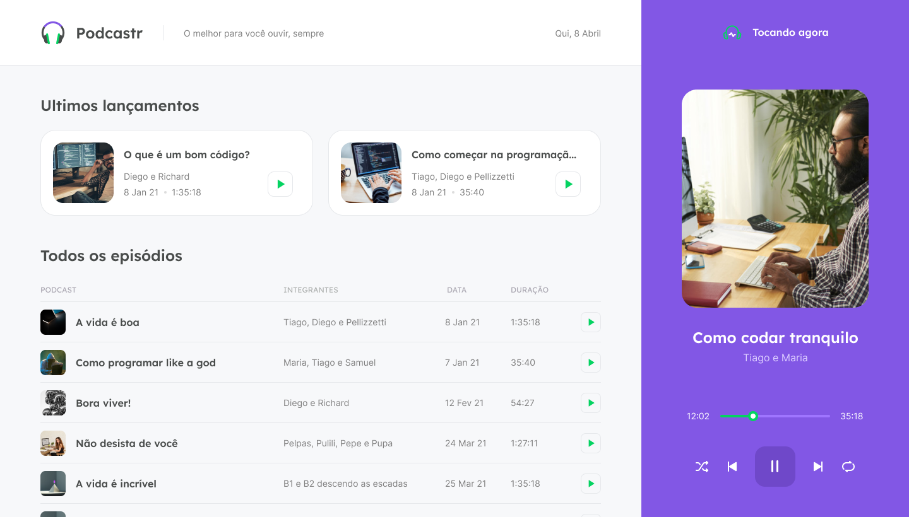
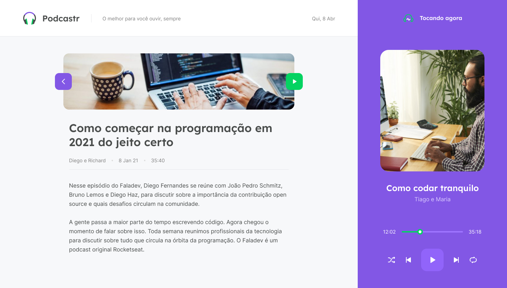

<h1 align="center">
    <br>
    
</h1>
<h4 align="center">
    Trilha ReactJS 
</h4>
<!-- <h4 align="center">Projeto web construído durante o Next Level Week #05-Discovery com a Rocketseat/DiegoFernandes.</h4> -->
<p align="center">
    
    <a aria-label="Completado" href="https://nextlevelweek.com/episodios/react/5/edicao/5">
        </img>
    </a>
    
    <a href="https://github.com/NyctibiusVII/Podcastr/blob/main/LICENSE">
        
    </a>
    <a href="https://picpay.me/Matheus_nyctibius_vii">
        
    </a>
</p>
<p align="center">
    <a href="#podcastr-">Projeto</a>&nbsp;&nbsp;&nbsp;|&nbsp;&nbsp;&nbsp;
    <a href="#tecnologias-">Tecnologias</a>&nbsp;&nbsp;&nbsp;|&nbsp;&nbsp;&nbsp;
    <a href="#layout-">Layout</a>&nbsp;&nbsp;&nbsp;|&nbsp;&nbsp;&nbsp;
    <a href="#licença-%EF%B8%8F">Licença</a>
</p>
<!--
<p align="center">
    <a href="README.md">Inglês</a>
    ·
    <a href="README-pt.md">Português</a>
</p>
-->

# Podcastr
Projeto desenvolvido durante a Next Level Week #5 @Rocketseat, feito para gerenciar podcasts e ouvir podcasts 🎧.
<br>

###  Rodando o projeto na sua maquina 🚀

### Clone o repositório
```
$ git clone https://github.com/lui7henrique/podcastrnext
```
    
### Instale as dependências
```bash
$ yarn install 
//ou 
npm install
```

 ### Execute o script "server" 
```bash
$ yarn server
//ou 
npm run server
```

### Execute o script "dev"
```bash
$ yarn dev 
//ou 
npm run dev
```

### O projeto inciará na porta: 3000 - acesse em http://localhost:3000
#### Aulas 
* ✅ Aula 01: Liftoff
* ✅ Aula 02: Maximum speed
* ✅ Aula 03: In orbit
* ✅ Aula 04: Landing
* ✅ Aula 05: Surface exploration

## Tecnologias 🚀
Esse projeto foi desenvolvido com as seguintes tecnologias:
- [Html](https://pt.wikipedia.org/wiki/HTML)
- [Sass](https://sass-lang.com/)
- [Typescript](https://www.typescriptlang.org/)
- [ReactJS](https://pt-br.reactjs.org/)
- [NextJS](https://nextjs.org/)
- [NodeJS](https://nodejs.org/en/)

## [Layout](https://www.figma.com/file/4HHorHq7GRBgZBaFdbtZlv/Podcastr-(Copy)?node-id=160%3A2761) 🚧
## Desktop Screenshot
<div style="display: flex; flex-direction: 'column'; align-items: 'center';">
<!-- Responsive, 1440 x 900, 50% (Laptop L - 1440px)-->
    
    
    
</div>
<a href="./.github/README-IMGS.md">Ver mais</a>

## 🧠 Desafios 
  - [x] Readme
  - [ ] Responsividade 
  - [ ] Dark Theme
  - [ ] Refazer o projeto porém com músicas
  - [ ] Refazer o projeto porém com filmes
---

## Contribuição 💭
Feito com 💜 e ☕ by Lui7Henrique
